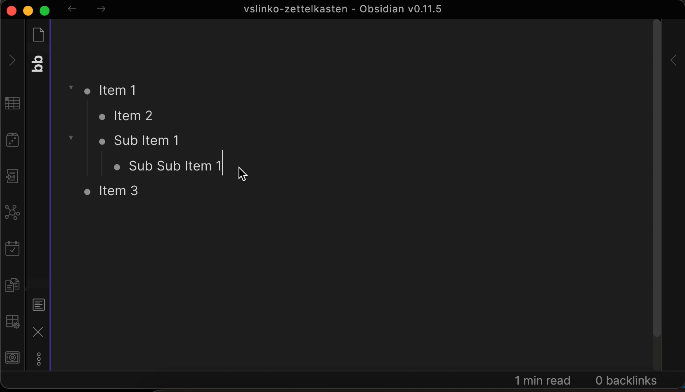

# Obsidian Outliner

Work with your lists like in Workflowy or RoamResearch.

## Demo

## Supported hotkeys

- `Tab`, `Shift-Tab` - Change item and subitems indent.
- `Cmd-ArrowUp`, `Cmd-ArrowDown` - Expand / collapse.
- `Cmd-Shift-ArrowUp`, `Cmd-Shift-ArrowDown`, - Move item and subitems.
- `ArrowDown`, `ArrowUp`, `ArrowLeft`, `ArrowRight`, `Cmd-ArrowLeft`, `Cmd-Shift-ArrowLeft` - Move cursor within list content.
- `Cmd-Backspace` - Delete item content without deleting item.
- `Backspace` - Delete item.
- `Enter` - Create new item down below.

## Todo

- Multi-item workflow.
- Support other types of lists (currenly supported only `\t*- `).
- Tests.
